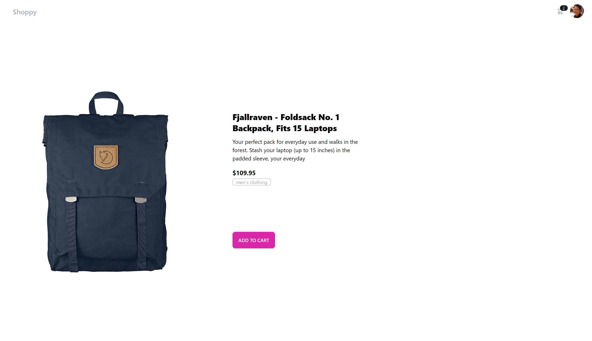
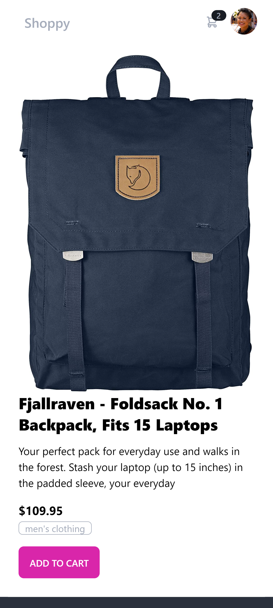
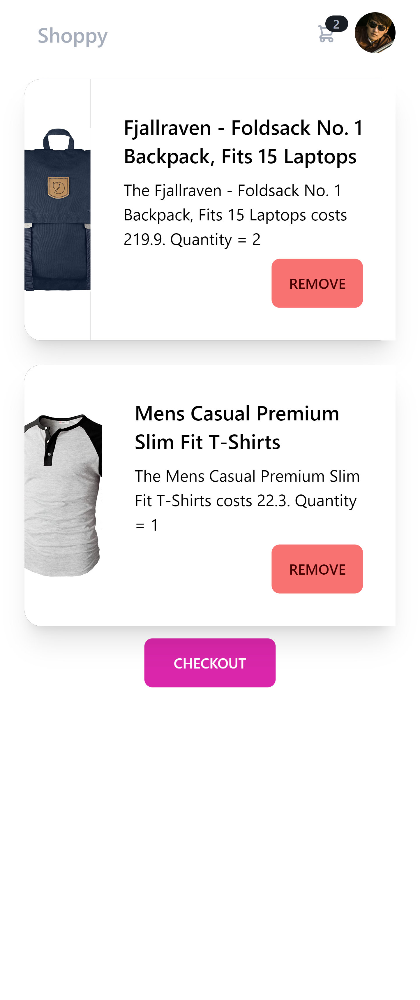

# Shoppy

This is a simple shop built as coding test for a job application.

## Features
- Add items to cart
- Remove items from cart
- View cart
- View item details
- Filter items by category

## Technologies
- React
- Tailwind
- React Router
- DaisyUI
- Github CI

## Requirements
- Node.js
- NPM

## Installation

1. Clone the repository
2. Run `npm run install`
3. Run `npm run start`

## Live
shoppy-two.vercel.app/

## What Can be improved:

- Tests
- Caching
- Better error handling
- Memoization query results/requests
- Performance optimizations

Sreenshots:

